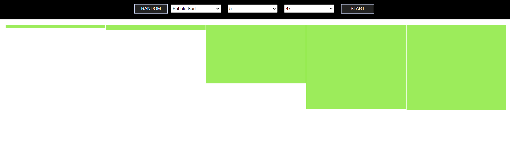

# Algorithm Visualizer

A React-based tool for visualizing algorithms. This application provides interactive visualizations of various algorithms, helping users understand their behavior and performance.

## Demo

Here are some screenshots showcasing the functionality of the Algorithm Visualizer:

- **Demo 1:**
  

- **Demo 2:**
  

- **Demo 3:**
  

## Features

- Interactive visualizations of popular algorithms.
- Real-time updates and step-by-step execution.
- User-friendly interface for algorithm analysis.

## Supported Algorithms

1. **Bubble Sort**
   - **Time Complexity:**
     - Best: O(n)
     - Average: O(n^2)
     - Worst: O(n^2)
   - **Space Complexity:**
     - O(1)

2. **Insertion Sort**
   - **Time Complexity:**
     - Best: O(n)
     - Average: O(n^2)
     - Worst: O(n^2)
   - **Space Complexity:**
     - O(1)

3. **Selection Sort**
   - **Time Complexity:**
     - Best: O(n^2)
     - Average: O(n^2)
     - Worst: O(n^2)
   - **Space Complexity:**
     - O(1)

4. **Merge Sort**
   - **Time Complexity:**
     - Best: O(n log n)
     - Average: O(n log n)
     - Worst: O(n log n)
   - **Space Complexity:**
     - O(n)

5. **Quick Sort**
   - **Time Complexity:**
     - Best: O(n log n)
     - Average: O(n log n)
     - Worst: O(n^2)
   - **Space Complexity:**
     - O(log n) (in-place version)

6. **Heap Sort**
   - **Time Complexity:**
     - Best: O(n log n)
     - Average: O(n log n)
     - Worst: O(n log n)
   - **Space Complexity:**
     - O(1)

## Live Demo

You can visit the live version of the Algorithm Visualizer at: [Algorithm Visualizer](https://mrpeace-algovisualiser.netlify.app/)

## Setup

To run the Algorithm Visualizer locally, follow these steps:

1. **Clone the repository:**

    ```bash
    git clone https://github.com/yourusername/algorithm-visualizer.git
    ```

2. **Navigate to the project directory:**

    ```bash
    cd algorithm-visualizer
    ```

3. **Install dependencies:**

    ```bash
    npm install
    ```

4. **Start the development server:**

    ```bash
    npm start
    ```

## Contributing

Contributions are welcome! Please open an issue or submit a pull request with your suggestions or improvements.

